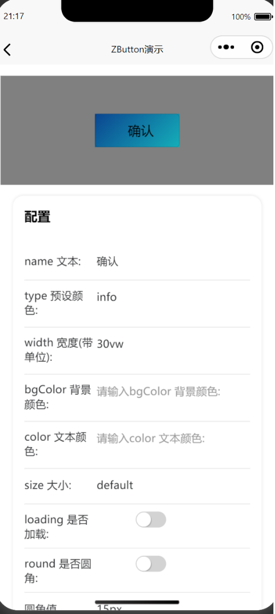
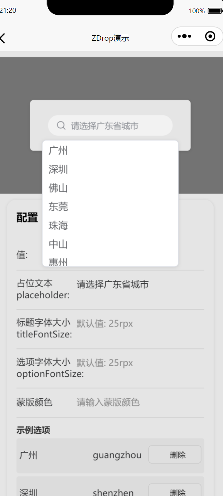
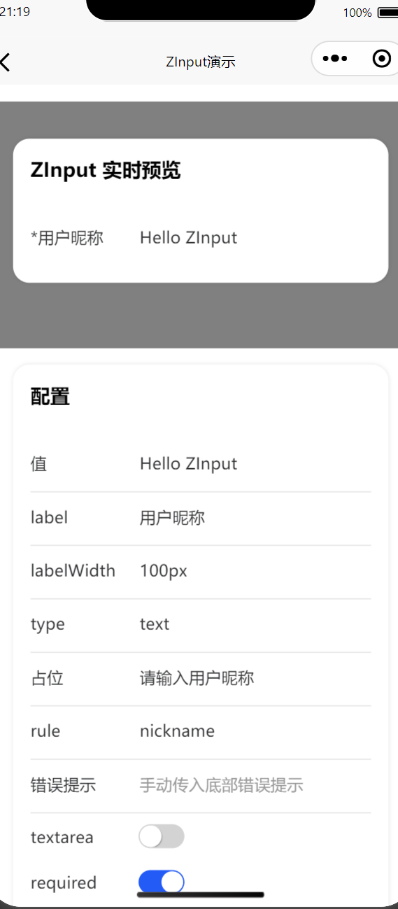
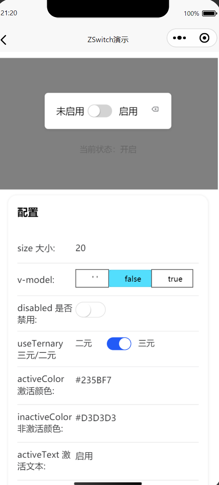
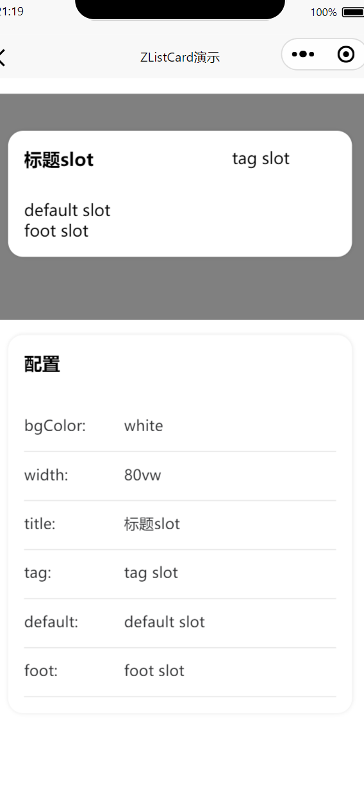

# 🎨 zmini

&gt; 基于 [uview-plus](https://www.uviewui.com/) 的 **Vue3** 轻量级业务组件库，专注于 **uni-app** 微信小程序开发。  
&gt; 提供 **高一致性**、**高易用性**、**高可扩展** 的通用业务组件，一行代码即可拥有美观、交互友好的移动端 UI。

---

## ✨ 特性

- 🚀 **Vue3 + script-setup + ts** 全新语法，极致开发体验  
- 🎯 **完全兼容 uview-plus** 样式变量与主题，可无缝迁移  
- 🪄 **高阶封装**，内置业务交互逻辑，减少 50% 冗余代码  

---

## 📦 使用

```bash
# npm
npm i zmini -S

# pnpm
pnpm add zmini


# pages.json
配置 自动导入
"easycom": {
		"autoscan": true,
		"custom": {
			// uni-ui 规则如下配置
			"^uni-(.*)": "@dcloudio/uni-ui/lib/uni-$1/uni-$1.vue",
			"^u--(.*)": "uview-plus/components/u-$1/u-$1.vue",
			"^up-(.*)": "uview-plus/components/u-$1/u-$1.vue",
			"^u-([^-].*)": "uview-plus/components/u-$1/u-$1.vue",

            // 下面一行是zmini自动导入规则
			 "^Z([^-].*)": "zmini/packages/components/Z$1/Z$1.vue"
		}
	}

```

## 📦 查看演示

```bash
# git
git clone https://github.com/Cluno-1/zmini

# powershell
cd zmini/exmples

# window
用Hbuilder打开 -> 运行 -> 查看微信开发者工具的演示

```

## 组件概览

| 组件   | 类别     | 简述                                                                 |
| ------ | -------- | -------------------------------------------------------------------- |
| ZButton | 基础   | 按钮，支持 12 种预设色、自定义颜色、尺寸、圆角、加载中等               |
| ZDrop   | 表单   | 下拉选择，支持搜索过滤、蒙层颜色自定义、展开收起动画                   |
| ZInput  | 表单   | 输入框/文本域，支持禁用纯展示、字数统计、rule 校验、错误提示等          |
| ZSwitch | 表单   | 开关，支持激活/非激活/置空三态，可自定义颜色与文案                     |
| ZCard   | 布局   | 卡片容器，提供 title、tag、default、foot 四组插槽，支持自定义背景色/宽度 |

## 📸 快照

| ZButton | ZDrop | ZInput |
| :-----: | :---: | :----: |
|  |  |  |

| ZSwitch | ZCard |
| :-----: | :---: |
|  |  |
